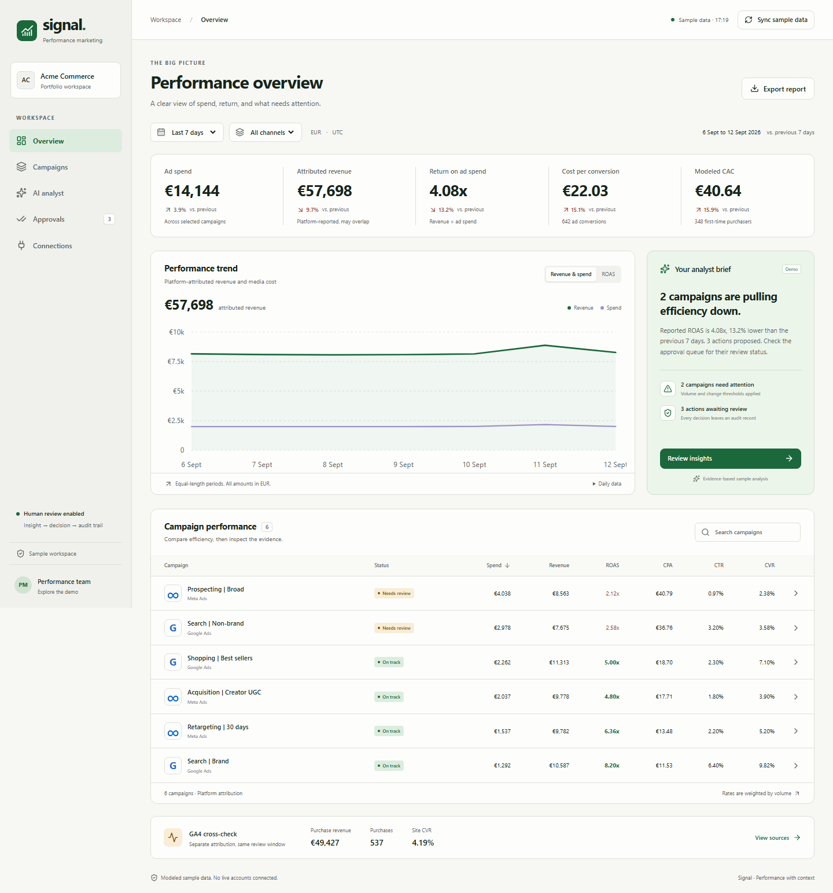

# AI Performance Marketing Command Center

**Signal** is a working portfolio application that turns advertising and analytics data into evidence, recommendations, and human decisions. One Next.js application runs the dashboard and all backend route handlers.

Live application: [Marketing Command Center](https://marketing-command-center-deepakprabhs-projects.vercel.app). Choose **Explore sample data** or **Upload my report** without an account or live advertising connection. The public sandbox processes campaign reports locally in browser memory; refreshing or closing the tab clears the dataset and simulated decisions. No report data is uploaded or sent to AI providers.

The separate [private workspace](https://marketing-command-center-deepakprabhs-projects.vercel.app/workspace) retains individual invited sign-ins, recovery and Supabase permissions. Vercel account login is not required.

Password recovery is implemented and production-tested. Resend delivery to general recipients still requires a verified sender domain and Supabase custom SMTP. See [email delivery](docs/email-delivery.md).



## Run locally

Requires Node.js 22.13+ (Node 24 recommended).

```powershell
cd "C:\Users\revat\OneDrive\Desktop\Agentic engineering\AI Performance Marketing Command Center"
npm ci
npm run dev
```

Open [localhost:3000](http://localhost:3000) for public evaluation. No secrets or external accounts are required. Public sample data includes 56 days of modeled advertising facts for six campaigns, ending **12 September 2026**. `/workspace` retains the original dashboard, including modeled GA4 facts in demo mode.

Public CSV imports accept campaign-level daily Google Ads or Meta exports. Required fields are campaign ID, campaign name, daily date (`YYYY-MM-DD`), spend, impressions and clicks. Conversions and conversion value are optional; unavailable fields are never interpreted as zero. Common English headers are detected, with manual matches when needed. One currency per report, up to 2 MB and 10,000 rows. Duplicate campaign/date rows, malformed values and multi-day summary rows block import with contextual errors. CSV examples are available in the interface. Complete adjacent windows are required for campaign anomaly claims; shorter uploads still provide observed totals.

## What works

- Validated Google Ads, Meta Ads and GA4 export ingestion, JSON imports, and atomic campaign/date upserts.
- Weighted ROAS, CPA, CTR, ad CVR, GA4 site CVR, and CAC when first-time purchaser coverage is complete.
- Equal adjacent 7/14/28-day comparisons, channel filters, campaign search, sortable tables, interactive chart and campaign deep dives.
- Minimum-volume anomaly rules with explicit thresholds and measurement caveats.
- Deterministic sample analyst plus a server-only OpenAI Responses adapter with schema, campaign, budget and evidence validation.
- Pending → approved/rejected workflow with required notes, conflict protection, source-version checks, and immutable database audit events.
- Durable Supabase mode, individual invite-only sign-ins, four permission roles, scoped workflow access, n8n definitions, CSV exports and sync history.
- Database migration tests, unit tests, browser tests, CI, standalone production build, Docker and Vercel configuration.

## Try the portfolio story

1. Choose **Explore sample data** and follow **Review the evidence**.
2. Inspect the campaign observations, open its recommendation and record a simulated decision with a note.
3. Change period/channel, search campaigns and export the selected report.
4. Try **Upload another report** using either downloadable CSV example or your own daily export. Preview and correct matches before replacing the dataset.
5. Use **Clear my data** to return to welcome. Refresh also clears the public sandbox. Private database-backed decisions remain separate.

## Connected Supabase mode

The app is linked to project `btgavjndnsegdsaspsmx`, with both migrations applied. See [individual sign-ins, permissions and operator setup](docs/auth.md). For a new installation, link the intended project and apply **all** migrations using `supabase db push`; do not rerun initial SQL over existing tables.

Copy `.env.example` to `.env.local` and set:

```dotenv
DATA_MODE=supabase
AI_PROVIDER=demo
SUPABASE_URL=https://your-project.supabase.co
SUPABASE_PUBLISHABLE_KEY=<publishable key>
SUPABASE_SECRET_KEY=<server-side secret key>
WORKSPACE_ID=11111111-1111-4111-8111-111111111111
WORKFLOW_TOKEN=<separate random token of at least 32 characters>
```

Restart the app, open your administrator invitation to set a password, sign in, and explicitly load sample data or import a batch. Administrators invite users and manage roles in **Workspace access**. Reporting uses validated user identity and RLS, not the server secret. Workflow credentials cannot approve or manage members. The app selects one workspace, while database policies isolate workspace memberships. No shared app password is used.

## Optional live AI

In authenticated Supabase mode, set `AI_PROVIDER=openai`, provide `OPENAI_API_KEY` through server environment configuration, and optionally set `OPENAI_MODEL` (default `gpt-5-mini`). Click **Run analysis**. Only aggregate campaign metrics and evidence are sent; raw source exports and customer records are not sent. Provider failures, incomplete output, unknown campaigns, unsupported evidence and out-of-bounds budgets reject the analysis without saving recommendations. Live OpenAI requests require your own configured account and were not made during MVP verification.

## Tests and production

```powershell
npm run check
npx playwright install chromium
npm run test:e2e
npm run build
npm start
```

`check` runs lint, type checking, unit/database tests and a production build. PGlite executes the actual Postgres migration, including upsert replay, rollback, approval conflict and immutability tests. Browser tests exercise the marketer flow and mobile navigation. Development and production builds use separate output folders to avoid concurrent-build conflicts.

Deployment details: [deployment](docs/deployment.md). Data definitions: [measurement](docs/measurement.md). Integration contracts: [API](docs/api.md), [live adapters](docs/live-integrations.md), [workflows](workflows/README.md). Design and system boundaries: [architecture](docs/architecture.md).

## Practical limits

Demo state is isolated by an HTTP-only browser cookie but stored in server memory. It expires after 24 hours, is evicted beyond 100 sessions, resets on restart, and does not guarantee persistence across serverless instances. Use Supabase for durable approvals or real marketing data. Hosting-level rate limiting is recommended before exposing live AI; the app’s rate limits are best-effort per process. Reporting reads the latest 56-day fact window, paginates Supabase queries, and caps reads at 20,000 facts per table. There is no execution adapter for live ad changes: approval creates an execution handoff record for a human.

The source adapters ingest realistic **export contracts**, not live API calls. Ad-platform returns can include overlapping attribution and are not incremental profit. First-time purchaser counts in the fixture are modeled, and must come from customer/order data in a live integration. The app accepts EUR and UTC date buckets only. Credentials, OAuth consent, API permissions, attribution configuration and real account tests are the next integration work.
